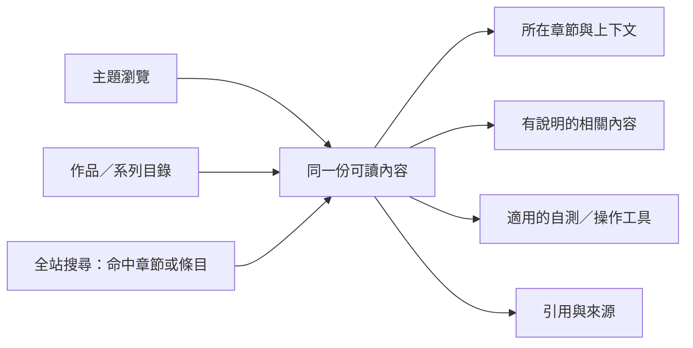

# Cortex 適合成為什麼樣的網站？

研究日期：2026-09-05。這份是已執行的案頭研究與設計推論；真人找路、手機操作、搜尋效能和視覺原型尚未驗證。接續 [研究計畫](PLAN.md)，成長來源與量測定義見 [GROWTH_MAP](GROWTH_MAP.md)。

## 1. 目前最有依據的方向

**建議以「可持續擴充的主題知識館」作為下一輪原型的主案：讀者直接接觸可讀的主題文章、書籍章節與具體條目；全站提供完整瀏覽與搜尋，不同材料有適合自己的閱讀或操作介面。**

「知識館」只是本研究對產品形態的稱呼，不是要放在網站上的新術語。它的具體差異是：進站就看得懂有哪些內容；讀一個主題可以一路讀下去；查某一小段可以直接抵達；增加內容時，既有位置與連結仍能使用。這個方向的信心目前為中等，來自內容結構、既有失敗經驗和前例；尚無本站使用者比較測試。

本案沒有理由先把需求封成六種，也沒有理由把內容限定為四個互斥領域。即使未來完全不接其他專案，CSCS 已含設施管理與督導，UST 已含課室管理與線上教學；它們的實際用途就比首頁少數任務廣。只把四領域改成六領域、十三領域，仍可能重演先定盒子再塞內容的問題。

主案需要的長期結構是：**內容的身分穩定，進入內容的路徑可以增加。** 同一份「間隔重複」材料可由書籍、學習主題與相關文章找到；每增加一條路徑，不另抄一份正文。主題、人名、作品、方法也不必全部壓成同一層分類。

## 2. 這次研究增加了哪些實際證據

這次沿 my-site 與九個相關專案追查規範、近期狀態、路線圖和資料樣本，保存 44 份文件的指紋；逐檔檢查兩個文本庫 metadata，共 76 與 4,683 份；讀取古籍標註結構；檢視心理學四份 reader profile；另查看 CSCS 全 24 章各首末兩筆的題目及答案片段，共 48 筆。這是跨章與異質資料的結構探查，並非全庫逐句深讀。抽樣 ID、範圍與限制保存在 [growth-inventory.json](growth-inventory.json)。

| 實際發現 | 為何影響網站形態 | 證據位置 |
|---|---|---|
| 原先已盤到 81 Markdown，其中 56 本文空白，由 YAML／模板輸出；資料又含 1,557 CSCS 條目、1,252 閃卡 | 文件數、網址數、可查找單位不能混為一談；不能只照 Markdown 目錄設網站 | [BASELINE](BASELINE.md)、[inventory](inventory.json) |
| CSCS 不只考試知識：ch23 設施位置、ch24 使命聲明與督導，和 ch02 計算題、ch15 動作技術的閱讀方式不同 | 同一書系需要連續閱讀、公式／例題、程序和精確查找；不能全做相同問答卡 | `data/cscs/ch02.yaml`、`ch15.yaml`、`ch23.yaml`、`ch24.yaml`；48 筆清單見快照 |
| 題目有「來源」「急性反應」「訓練適應」等依賴章節語境的短標題 | 搜尋結果必須帶主題與章節；只丟出原題目會產生另一種不直覺 | `ch04.catecholamines.i01`、`ch05.cardiovascular-adaptations.i01` |
| MNFL 和 UST 都有間隔重複、番茄鐘等方法，前者偏自身學習，後者帶教學情境 | 可在同一主題相遇，但保留書籍出處、讀者情境和不同做法，不因同名就去重合併 | `data/mnfl/techniques.yaml`、`data/ust/strategies.yaml` |
| Vortex 自由式一個動作同時有物理說明、感知、邊界、提示語、練習；drill 另有目的、步驟、成功／失敗訊號及多軸限制 | 動作解說與池邊操作卡需要互通，顯示重心也要不同 | `data/vortex/free.yaml` 首筆、`data/vortex/drills.yaml` 的 `Fr1` |
| 神經化學曾做了大量證據記錄，卻沒有讀者能讀的文章；2026-08-08 明確改為敘述層＋證據層 | 資料庫整理完，不等於網站內容完成；應先確保文章講清楚，再讓關鍵句可追證據 | [神經化學 HANDOFF](../../../neurochemistry-knowledge-atlas/HANDOFF.md) 的 ACTIVE WORK |
| 恢復章和生成器都有明確 my-site 接線計畫，目前對應 recovery 目錄／站內規則副本尚未存在 | 必須容納新專題與互動工具；它們不是單純新增文章卡片 | [恢復計畫](../../../TheVortexProject/plans/recovery_integration_plancheck.md)、[生成器計畫](../../../swim-coach/plans/menu_generator_plan.md) |
| 古籍有 22,545 筆段級標註；宗教庫原文檔合計約 675 MB；來源狀態與完成狀態有差異 | 未來需作品／章節／段落定位、版本語言、分段載入與清楚的可讀狀態；不能全庫灌進一頁 | [GROWTH_MAP](GROWTH_MAP.md) 的計數口徑與原始快照 |

上述內容舉例只用來判讀呈現需要，沒有在本次重新驗證生理、心理、醫療或法規敘述的正確性。

## 3. 比較哪些網站形態，以及為什麼

以下是案頭適配判斷，不是使用者成功率，也不以任意分數包裝實驗結果。

| 形態 | 本站能受益的地方 | 單獨當全站核心時的缺口 | 本案處置 |
|---|---|---|---|
| 部落格／雜誌 | 新文章、研究進展、修訂說明 | 更新時間不等於知識位置；舊章節、工具、版本對照容易沉底 | 用於「最近新增／實質更新」及長文的編排 |
| 教材／課程網站 | 書籍順讀、前備知識、練習與自測 | 不是每個人都從第一章開始；課室管理、術語、原文比對未必有單一學習順序 | 書系與適合的主題提供閱讀順序；不強迫全站線性化 |
| 百科／Wiki | 穩定條目、概念解釋、相關內容與來源 | 單一百科頁不能直接取代題庫、自測、生成器或多版本閱讀器 | 作主案的閱讀骨架；實作不必採 Wiki 軟體或開放編輯 |
| 數位圖書館 | 作品、作者、版本、章節、檢索與引用 | 純書架仍要求人先知道去哪本書；跨書理解需要編輯整理 | 保留書籍與原文的完整路徑，再以主題連接 |
| 資料檢索工作台 | 精確查找、多條件篩選、快速比較 | 沒有詞彙的人無從下手；原始記錄多不代表容易理解 | 全站及集合內的查找介面，搭配可瀏覽內容 |
| 知識圖譜為首頁 | 查看已定義的局部關係 | 本站關係層並不齊全；跨庫同名不等於同一概念；密集圖不能代替文章與目錄 | 只在有具體閱讀問題和可靠關係時，做局部圖／時間軸 |
| 導引式任務入口 | 已知高頻流程可快速完成 | 人可能不知道需求怎麼稱呼；有限選項把探索與未預期需要排除 | 放在相關主題或工具附近，作可選捷徑；不能包辦全站入口 |
| **主題知識館（組合主案）** | 百科式文章、書系閱讀、條目查找及工具共存；內容新增可沿既有型別接入 | 需要維護主題與內容的連結；若主題頁只有卡片，仍是空入口 | 優先製作可讀內容充分的原型，並保留搜尋主導的不同方案比較 |

### 實際前例教了什麼

選站依「它解決本站哪一個問題」，不是依視覺潮流。

| 前例及實際開啟頁 | 觀察到的機制 | 本案轉用與限制 |
|---|---|---|
| [Stanford Encyclopedia of Philosophy：Plato](https://plato.stanford.edu/entries/plato/)、[總目錄](https://plato.stanford.edu/contents.html) | 條目先有導讀，再有頁內目次、連續正文、書目、相關條目；出版／實質修訂資訊可區分 | 長文章要讓人讀得下去且能定位、引用。沒有照抄它的內容密度，也不宣稱學術百科的讀者等於本站讀者 |
| [MDN：Learn](https://developer.mozilla.org/en-US/docs/Learn_web_development)、[Array.map 參考頁](https://developer.mozilla.org/en-US/docs/Web/JavaScript/Reference/Global_Objects/Array/map) | 學習路線與單項參考頁分開服務；參考頁有說明與例子 | CSCS 順讀／單題查找／練習可互通，不必讓三種用途共用一種頁面順序。技術文件的術語熟悉度不可直接外推到本站 |
| [Our World in Data：Mental Health](https://ourworldindata.org/mental-health) | 一個主題下有導讀、文章與圖表，另可看全部相關圖表 | 主題頁應先說明內容範圍與關係，再接到具體材料；不是把所有內容同尺寸平鋪。本站沒有同等數據，不能為了模仿而發明圖表 |
| [SuttaCentral 官方 Bilara 資料說明](https://github.com/suttacentral/bilara-data) | 原文、譯文、註解可透過不變的 segment ID 對應；發布與工作中資料有區別 | 長文本分頁後，段落身分仍保留；同一作品不同語言不能按段序猜對齊。這是資料與發布架構前例：SuttaCentral 前台只取得 JS 提示殼，本次沒有成功測其閱讀 UI |

CTEXT 頁面與部分前例深層網址未能擷取，不列為已完成的畫面研究。前例之間的共同做法只能支持候選機制，不能證明本站應照搬某個選單。

## 4. 網站實際應該怎麼呈現

### 4.1 首頁：讓內容本身說明這裡有什麼

首屏直接呈現可讀內容的範圍與實例，提供全站搜尋和明確可展開的完整瀏覽。入口的名稱應能預告點下去會看到的內容。Vortex、CSCS、MNFL、UST 可保留系列身分，但對陌生讀者同時顯示中文名稱或說明。

主案首頁的內容順序候選：

1. 簡短站點介紹、全站搜尋、「瀏覽所有主題／內容」。搜尋提示可以放具體內容名稱，不只寫「搜尋知識」。
2. **可掃讀的主題目錄**：每列用主題名稱、範圍說明、少量真實子題與「看全部」說明內容。主題數依內容與測試調整；完整目錄可到獨立頁，不要求所有主題擠在首屏。
3. 書籍／系列的另一條瀏覽路徑，保留原來的閱讀順序和出處。
4. 近期新增／實質修訂與可使用工具；沒有流量資料就不標「最熱門」。新工具也能從它所屬的主題進入。

命名材料先從具體內容取樣，例如自由式換氣、出發與轉身、肌肉動作、訓練恢復、設施管理、記憶與複習、課室管理、線上教學、氣質差異；再觀察讀者怎麼理解、分組與繼續探索。**不預先指定它們該合成幾個大分類。** 尤其設施管理如何被發現、陌生讀者是否理解氣質，都應拿實際問題測。將來新增主題時，不補一排空的「即將推出」。

視覺上先試「清楚的文字目錄＋編輯式主題摘要」：用標題、段落、留白和位置建立層次；大量同尺寸卡片、每主題一種強色並無必要。文章可有少量圖解；圖必須解釋動作、關係或比較，不能只為裝飾。版式和顏色仍需原型比較，不將此偏好當定案。

### 4.2 主題頁：先講清楚，再接完整內容

「主題頁」應有一小段足以開始理解的導讀；先說明這裡涵蓋什麼、有什麼不同觀點或用途，接著提供進一步閱讀。已有充分內容的窄主題，可以直接是一篇完整文章，毋須多包一層入口。

例：未來「訓練與恢復」若接入恢復章，可並列 CSCS 的相關章節、Vortex 週期化與恢復研究。每一項要說明它的角色：教材如何解釋、游泳情境如何使用、哪些問題還有爭議。不能由共有「恢復」二字，自動合成一個折衷結論。

主題頁下方的集合索引才承擔大量條目的瀏覽。篩選器依集合長出：找游泳練習可用器材／泳式；找文本可用作品／語言；不把所有集合的篩選條件混成一大排。

### 4.3 內頁：依材料和使用方式決定主次

下表覆蓋目前盤點出的內容族，另外列出已規劃型別。這些是可共用的版型家族，不是另一組頂層選單。

| 內容族 | 建議主要呈現 | 次要操作與必要語境 |
|---|---|---|
| Vortex 水感、L 層、Bridge 與研究散文 | 有導讀、章節目次的連貫說明；術語就地解釋 | 隨段提供相關泳式、例子與練習；明確標示框架與來源的角色 |
| 六式 51 動作、222 技術分析、102 教學誤區 | 按泳式和動作階段順讀；單一問題也可深連結 | 「怎麼做／感覺／常見問題／原因」依資料適用性編排；不要把一個動作的全部內容藏成多重收合 |
| 176 drills | 緊湊可篩選的清單 → 完整操作頁或可分享的條目 | 目的、器材與條件先見；步驟、觀察訊號、相關動作緊鄰；池邊版可列印 |
| 47 injuries、關節命名與 movement 128 筆 | 清楚的部位／動作索引，配角色與適用條件 | 相關肌群與介入的關係表；安全限制貼近步驟；不把研究工具畫成個人診斷 |
| 呼吸 21 節點、週期化 42 節點、心理 8 主題 | 主題文章＋局部比較或程序說明 | 呼吸必要安全資訊保持可見；條件、族群與不確定性不因摘要消失 |
| ADM 與 22 standards | 說明框架後，以階段／支柱作可讀表格和篩選 | 數值帶單位及定義；不能把發展框架顯示成每人必經同一時程 |
| CSCS 24 章、198 topics、1,557 items、1,252 cards、22 concepts | 同一份資料的三個閱讀出口：章節、可定位單題、可選自測 | 章節頁保留上下文；搜尋結果帶章名／主題；概念頁聚合關聯；公式和計算題保留推導步驟 |
| MNFL 20 techniques、UST 10 章／18 strategies | 方法解說和教學示例；書籍順讀路徑同時存在 | 同名方法顯示情境與來源，不直接去重；每方法補可用穩定定位 |
| 氣質 9 維度、類型、5框架、適配／批判與兩組18題 | 說明與比較可直接閱讀；自評為可選獨立流程 | 成人／兒童模式明確；結果可返回維度與限制，不讓問卷擋在所有知識前面 |
| 來源與引用 | 文章中就地引用，另有完整來源資訊與引用它的內容 | 研究者需要時能追查；來源數量和驗證 badge 不是文章的主敘事 |
| 規劃：恢復、多巴胺等新長文 | 接既有主題文章版型，有實際正文才開頁 | 各文章保留來源 owner 與發布條件 |
| 規劃：一次性菜單生成器 | 輸入 → 適用條件／資料不足 → 可檢查的結果 | 結果能回查 drill；不將操作狀態塞成一般文章，也不預設需要登入 |
| 候選：學派 profile、比較、時間軸 | 文章為主；有對齊依據的局部比較、時間範圍圖 | 精確年份／十年區間分開；目前的 coverage 表不能冒充學派思想或療效比較 |
| 條件成長：古籍／宗教文本 | 作品介紹 → 目錄 → 章節／段落；可選譯文／註解 | 顯示版本、語言、原文／轉譯角色、翻譯狀態；段落能返回完整上下文 |

### 4.4 閱讀、查找和探索要能在同一份內容相遇

圖中的路徑可以繼續增加；內容不必複製。全站搜尋、主題索引、書籍目錄是互補的查找方式，不要求每位讀者先替自己選一種「需求身分」。

具體閱讀規則：

- 從外部搜尋進入內頁，也看得到站點、所在主題／系列、本文目次和回到完整目錄的方法。麵包屑表示目前閱讀路徑，不能宣稱它是內容唯一歸屬。
- 每頁首先回答頁名承諾的問題；不要先讓人看 schema、來源驗證數和工作進度。必要的適用條件、缺口與限制仍在相關內容旁說明。
- 收合適合延伸證據、詳細推導或輔助資訊；核心解說保持可讀。由 URL 命中的收合內容必須可見、可定位。安全必要內容不能只放進預設收起的區塊。
- 長文本按章節與可理解的段落邊界拆分，保留上一章／下一章及全書目次；不因字數剛好達門檻就在半句截斷。
- 手機以一條閱讀主線為主，目錄和集合篩選可呼出。雙語對讀改為同段上下或切換，能保持目前段落；不把三欄桌面直接縮小。
- 比較只對齊同一問題下可比的欄位。MNFL／UST 的同名技法、心理學不同 profile 的章節或古文的現代標籤，都不天然語義相等。

## 5. 用實際內容走一遍：主案如何接住目前漏掉的需要

以下都是研究者由內容推導的題目，不冒充真人提出或完成的任務。逐案推演讓架構可被檢查；操作成功仍須在原型測。

| 想做的事 | 在主案中的候選路徑 | 具體落點／判準 |
|---|---|---|
| 我不是來準備證照，我想看訓練場地與督導的安排 | 全站搜尋「場地／設施／督導」，或瀏覽內容再進設施管理 | CSCS ch23／ch24；不要求先懂 CSCS 縮寫或先選「考試」 |
| 我想完整理解週期化，讀到恢復時再追下去 | 主題導讀 → 章節順讀 → 有說明的恢復相關閱讀 | 現有 CSCS ch21／Vortex 週期化；恢復新章未發布前不提供假連結 |
| 我記得有個「來源」條目，但不知道是哪個物質 | 搜尋後顯示「兒茶酚胺的來源 — CSCS第4章／內分泌」 | 命中 `ch04.catecholamines.i01` 時保留原題，同時用章節語境消除歧義 |
| 我不會用「提取練習」這個詞，只想知道怎麼讓學生回想剛教過的內容 | 主題目錄有教學實例／自然用語；搜尋候選別名需查核 | UST `retrieval-practice` 等；新命名交真人理解測試，不由模型宣稱已解決 |
| 我想比較「間隔重複」在自己讀書和帶課時的做法 | 主題頁 → 帶情境的兩份方法 → 回原書章節 | MNFL／UST 各自保留出處；兩段不因相似而抹成一段 |
| 我正在池邊找不用器材的某泳式練習 | 練習集合 → 當地可用篩選 → 操作條目 | drills；完整步驟、條件和觀察訊號不被結果卡截斷 |
| 我只是想讀氣質說明，沒有要做測驗 | 直接進維度或框架文章 | 不先收問卷；未答題也能讀全篇 |
| 我正在看肌肉動作，想知道它與泳姿哪個階段有關 | 動作條目 → 已登錄的 stroke demand 關係 | movement 的 actions／muscle groups／stroke demands；無關係記錄不補假連線 |
| 我想知道多巴胺是怎麼回事，不想閱讀幾百列證據 | 條件接入後：可讀文章 → 有疑問的關鍵句 → 出處 | `articles/dopamine.md` 是內容形態樣本；尚未獲得本站發布狀態 |
| 我從古籍一句話搜尋進來，想知道前後文和版本 | 條件接入後：命中段落 → 同章上下文 → 全書／版本 | 用 `para_id` 對應；`[]` 表示無該類標註，不代表那一段不值得閱讀 |

另需保留沒有指定終點的探索測試：讓參與者逛內容，說出想繼續讀什麼、為何選它、以為下一頁會有什麼。不能把探索成功定義成最後一定點到研究者預先選的某張卡片。

## 6. 內容增加時，架構應如何變化

**新增內容通常改的是內容與索引；只有新增閱讀方式，才需要新介面。** 這是本案最重要的成長原則。

| 新增情況 | 應有變化 | 不應每次都被迫做的事 |
|---|---|---|
| 既有書系多一章、既有集合多100條 | 更新內容清冊、章節順序、搜尋與相關索引 | 改全站導覽、改每份 layout 的集合白名單 |
| 增加恢復這種同型新專題 | 登記來源與可發布輸出，補一篇導讀／文章及主題連結 | 新造一套整站分類或複製週期化正文 |
| 增加一個完全不同領域，但仍是可讀文章 | 在完整目錄有位置、搜尋可找到；需要時才增加可見主題 | 為湊現有領域改變文章內容，或先做空的大分類頁 |
| 增加生成器、雙語段落對讀等新用途 | 新版型／互動元件與其資料契約；原有閱讀頁維持可用 | 讓每一頁都下載該工具或全文庫 |
| 某個候選專案最後不加入 | 不出現空入口；已發布內容正常運作 | 用其他內容填滿為它預留的分類 |
| 原文新增譯本、章節分頁改變 | 新增 edition／segment 對應，保留舊定位與可解釋替代 | 以標題／頁碼重建 ID，使引用失效 |
| 原文撤回、來源被更正或內容改判 | 依來源狀態更新內容、搜尋、摘要及受影響工具；留必要歷史說明 | 舊搜尋摘要或工具結果仍把撤回資料當現行內容 |

目前已確認的成長、條件候選及排除清單見 [GROWTH_MAP](GROWTH_MAP.md)。大型文本庫是用來檢查架構邊界的真實場景，並非本次決定全數搬入。

### 最小內容契約與網站維護方式

不要求各 canonical 專案改成一種 schema。呈現層只需要讀取共同的路由與索引資訊：來源專案、原生 ID、型別、標題、可用語言、系列／章節、主題關聯、發布決定、來源版本，以及可解析的輸出 URL。實證材料、教學方法、文本和工具各保留自己的欄位。

候選資料流：來源內容 → 專屬 adapter → **明確選入的可發布內容 manifest** → 文章／集合／工具輸出 → 同一批產物的搜尋、索引和連結檢查。已有 Vortex 同步保留其來源規則；knowledge-hub 目前不自動發布，不能因它可查詢就直接訂閱全庫公開。

內容 owner 與呈現 owner 分開：引用和內容判讀在原 canonical 維護；頁名提示、目錄、版型與版面在 my-site 維護。主題導讀若包含新的綜合判斷，須明確指定誰撰寫及保存依據，不能把它藏成無人負責的生成摘要。

搜尋可先評估 Hugo 建置後的 Pagefind，因官方有靜態輸出、中文分詞、頁內子結果支援；**安裝不等於全站查找就完成**。需要測繁簡、縮寫、無空格詞、書籍限定、段落命中，以及結果中「內容所在處」是否清楚。Pagefind 預設依 HTML 語言分索引，並非輸入中文便會自動搜尋各語言全文；跨語言名稱與檢索策略要另測。[官方入門](https://pagefind.app/docs/)、[多語言](https://pagefind.app/docs/multilingual/)、[頁內子結果](https://pagefind.app/docs/sub-results/)

目前沒有證據要求更換 Hugo。先用現有技術驗證內容模型及主要閱讀方式；若大量文本的產物量、部署或搜尋實測遇到邊界，再比較獨立文本站／索引服務等方案。宗教專案已有另一個網站計畫，可先提供有範圍說明的連結或核准 metadata，不必為了統一入口而統一所有 runtime。

## 7. 應該優先做哪一輪驗證

保留 [PLAN](PLAN.md) 的 A／B／C 作組織假設，但不再讓「案頭研究後仍完全沒有主張」拖慢進度。**本報告提出的知識館作主案；搜尋工作台作有實質差異的對照案。** 開放需求研究若推翻主案，記錄哪個需要無法滿足並修改，無須維護這個名稱。

第一輪原型必須用真實內容形成完整路線，不能只畫首頁：

1. 全站目錄／搜尋 → CSCS ch23 或 ch24 的精確條目，用來測被考試入口掩蓋的內容。
2. 主題 → MNFL／UST 同名方法 → 原章節，測跨書探索和語境。
3. 游泳練習篩選 → 完整步驟 → 相關動作，測集合型資料與手機操作。
4. 長文章 → 頁內定位 → 來源，測連貫閱讀與查證。
5. 放入**標示為研究 fixture** 的恢復章結構、生成器頁殼、長文本章節及缺譯狀態，測成長契約；不得冒充這些內容已可發布。

先完成靜態找路與條目內容，再接必要互動。真人觀察同時記錄是否猜對入口、是否找得到原文語境、是否看得懂下一步；依實際用詞補測。性能測試以真實可發布試點及獨立合成擴量分別記錄，不能把 source YAML 大小當下載量，也不能把複製條目100次稱為真實內容覆蓋。

派工沿用並修訂 [MODEL_WORK_PACKAGES](MODEL_WORK_PACKAGES.md)：Terra 做結構與新增內容鏈驗證，Sonnet 做閱讀組織與命名候選，Sol 做完整路線原型，Astra 負責綜合取捨，Opus 獨立找反例。模型不能替真人證明「直覺」。

## 8. 哪些結論已經可以採用，哪些仍需驗證

可以作為後續工作依據：固定少數任務與四領域不構成需求全集；內容單位比文件數豐富；可讀敘述不能被原子證據表取代；需保留書系和上下文；成長應覆蓋新內容與新型別；跨專案接入必須按當前決定而非舊計畫標題判斷。

還不能定稿：最終主題名稱、首頁排序、哪種視覺最容易掃讀、主要讀者比例、搜尋用語與排序、文章拆分粒度、手機工具操作及多語言檢索效果。後續研究應優先消除這些會改變方案的未知；不必先讀完每個來源全文才准做可檢查原型。
